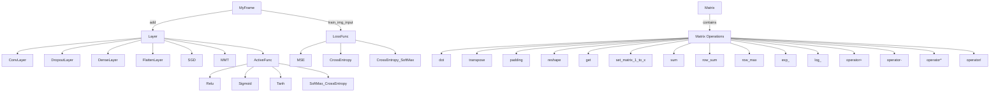

# This Cpp Machine Learning

這是一個基本的深度學習框架，包含了多種層、激活函數、損失函數以及矩陣操作。該框架的主要目的是提供一個簡單的方式來建立和訓練神經網絡。

## 架構圖

以下是該框架的程式碼架構圖：

## 主要類別

### MyFrame
主控制類別，負責訓練過程和管理層。

### Layer
基礎類別，所有層的基礎。

### ConvLayer, DropoutLayer, DenseLayer, FlattenLayer
具體層類別，實現不同的神經網絡層。

### LossFunc
損失函數的基礎類別，包含具體的損失函數如 MSE 和 CrossEntropy。

### ActiveFunc
激活函數的基礎類別，包含具體的激活函數如 Relu 和 Sigmoid。

### Matrix
用於數值計算的矩陣類別，包含各種矩陣操作。

## 使用方法

1. **編譯和運行**:
   - 使用支持 C++ 的編譯器編譯 `main.cpp` 和 `Matrix.h`。
   - 確保所有依賴的庫都已正確安裝。

2. **訓練模型**:
   - 修改 `main.cpp` 中的參數以設置模型的架構和訓練參數。
   - 運行程式以開始訓練過程。
